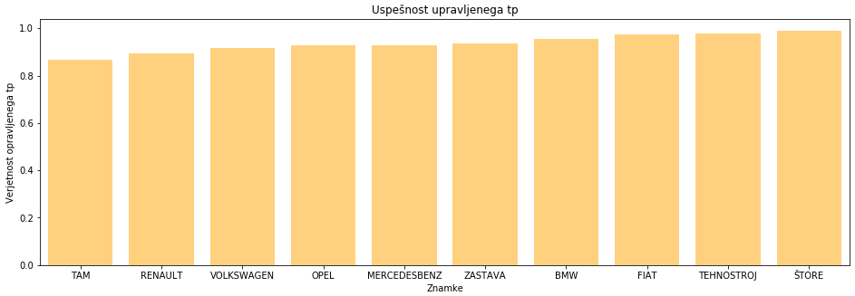

# Tehnčini pregledi motornih vozil v Sloveniji 2019

## Skupina
* Leon Macur - 63180190
* Kevin Mohar - 63180209

## Podatki in analiza
### Opis
Za projetkno nalogo sva se odločila analizirati podatke o tehnčinih pregledih motornih vozil, ki so potekali v Sloveniji leta 2019. Z uporabo metod podatkovnega rudarjenja želiva ugotoviti, kako so se opravljeni pregledi čez leto razlikovali. Predvsem naju zanima, katere znamke, starost motornega vozila, gorivo, prevoženi kilometri in ostale specifikacije vpilavajo na uspešnost opravljenega tehničnega pregleda.

### Podatki
Podatke sva pridobila iz strani "OPSI: odprti podatki" -> [rezultati tehničnega pregleda](https://podatki.gov.si/dataset/rezultati-tehnicnih-pregledov-motornih-vozil). Natančneje bova podatke črpala iz tekstovne datoteke "Uspešnost TP 2019". Datoteka ima 25 atributov in vsebuje podatke o vozilu, regestraciji, lastniku ter rezultate o nepravilnostih, obremenitvah in ugotovitvah pregleda vozil v Sloveniji za leto 2019.

### Analiza
#### Problem 1:
Pri tej nalogi sva želela ugotovite katera znamka vozil je najmanj zanesljiva pri opravljanju tehničnega pregleda, pri vozilih ki so bila prvič registrirana vsaj 25 let nazaj. To sva storila tako da sva najprej poiskala znamke vozil ki so imele vsaj 1000 zapisov v tabeli. Nato sva za vsako posamezno znamko izračunala verjetnost uspeha pri opravljanju tehničnega pregleda. Na koncu 10 znamk z najmanjšo verjetnostjo uspeha ter jih prikazala z ustrezno vizualizacijo.

```python
datum = datetime.strptime("01.01.1995", "%d.%m.%Y").date()

dictVoz = {}
for vozilo in dat:
    try:
        if datetime.strptime(vozilo[14], "%d.%m.%Y").date() < datum:
            if vozilo[21] != "":
                # Ali je vozilo že zapisano
                if re.sub("[ .-]", "", vozilo[0]) not in dictVoz:
                    dictVoz[re.sub("[ .-]", "", vozilo[0])] = [0, 0]

                # Ali je vozilo opravil tp
                if vozilo[21] == "brezhiben" or vozilo[21] == "pogojno brezhiben":
                    dictVoz[re.sub("[ .-]", "", vozilo[0])] = [dictVoz[re.sub("[ .-]", "", vozilo[0])][0] + 1, 
                                                               dictVoz[re.sub("[ .-]", "", vozilo[0])][1] + 1]
                else:
                    dictVoz[re.sub("[ .-]", "", vozilo[0])] = [dictVoz[re.sub("[ .-]", "", vozilo[0])][0], 
                                                               dictVoz[re.sub("[ .-]", "", vozilo[0])][1] + 1]
    except:
        pass

dictVoz = {key : value[0] / value[1] for key, value in dictVoz.items() if value[1] >= 1000}
dictVoz = {key : value for key, value in sorted(dictVoz.items(), key = lambda x: x[1])}

znamke = []
pr = []
i = 1
for k, v in dictVoz.items():
    znamke.append(k)
    pr.append(v)
    i += 1
    if i > 10: break
```



Ugotovila sva da najmanjšo verjetnos ima znamka 'TAM', ki pa kljub temu imajo še zmeraj kar visoko uspešnost.

#### Problem 2:
Pri tej nalogi sva želela ugotoviti v kateri enoti je opravljanje tehničnega pregleda najuspešnejše. To sva storila tako da sva za vsako posamezno enoto, v kateri je vsaj 100 vozil opravljalo tehnični pregled, preštela število vozil, ki so tam uspešno opravila tehnični pregled in ga delila s številom vseh vozil, ki so tam opravila tehnični pregled. Tako sva za vsako enoto dobila verjetnost uspešno opravljenega tehničnega pregleda v teh enoti. Iz dobljenih rezultatov sva izbrala 3 najbolj uspešne enote in 3 najmanj, ter jih ustrezno vizualizirala.

```python
stevilPregledovEnot = dict()

for line in dat:
    if line[24] in stevilPregledovEnot:
        if line[21] == "brezhiben" or line[21] == "pogojno brezhiben":
            stevilPregledovEnot[line[24]][0] += 1
        stevilPregledovEnot[line[24]][1] += 1
    else:
        if line[21] == "brezhiben" or line[21] == "pogojno brezhiben":
            stevilPregledovEnot[line[24]] = [1,1]

minPregledov = 100
uspesnostEnot = dict()

for key in stevilPregledovEnot:
    if stevilPregledovEnot[key][1] >= minPregledov:
        uspesnostEnot[key] = stevilPregledovEnot[key][0]/stevilPregledovEnot[key][1]
```


Kot lahko razvidimo iz grafa imajo najboljše 3 enote praktično enako verjetnost opravljenega tehničnega pregleda. Pravtako so te verjetnosti zelo visoke. Pri najslabših treh pa lahko opazimo večjo razliko med verjetnostmi. Opravljanje tehničnega pregleda v katerikoli enoti razen najslabši, bi imelo zelo visoko verjetnost uspeha.


#### Problem 3:
Pri tem problemu naju je zanimalo kako se spreminja uspešnost opravljenega pregleda skozi leto glede na tip goriva. Podatke sva najprej razdelila po mesecih, nato pa za vsak mesec podatke razdelila na 2 skupini. V eni skupini so bila tista vozila ki uporabljajo bencin, v drugi pa tista ki uporabljajo dizel. Za vsako od teh skupin sva za pripadajoč mesec nato izračunala verjetnost uspešnega opravljanja tehničnega pregleda. Podatke sva nato prikazal z ustrezno vizalizacijo.

```python
dictGorivo = {}
for i in range (1,13):
    dictGorivo[i] = {"b":[0, 0], "d":[0, 0]}

for vozilo in dat[1:]:
        try:
            datum = datetime.strptime(vozilo[19], "%m/%d/%Y").date().month
            if vozilo[12] == "Bencin":
                # Ali je vozilo opravil tp
                if vozilo[21] == "brezhiben" or vozilo[21] == "pogojno brezhiben":
                    dictGorivo[datum] = {"b": [dictGorivo[datum]["b"][0] + 1, dictGorivo[datum]["b"][1] + 1], 
                                         "d": [dictGorivo[datum]["d"][0], dictGorivo[datum]["d"][1]]}
                else:
                    dictGorivo[datum] = {"b": [dictGorivo[datum]["b"][0], dictGorivo[datum]["b"][1] + 1], 
                                         "d": [dictGorivo[datum]["d"][0], dictGorivo[datum]["d"][1]]}
            elif vozilo[12] == "Dizel":
                # Ali je vozilo opravil tp
                if vozilo[21] == "brezhiben" or vozilo[21] == "pogojno brezhiben":
                    dictGorivo[datum] = {"b": [dictGorivo[datum]["b"][0], dictGorivo[datum]["b"][1]],
                                         "d": [dictGorivo[datum]["d"][0] + 1, dictGorivo[datum]["d"][1] + 1]}
                else:
                    dictGorivo[datum] = {"b": [dictGorivo[datum]["b"][0], dictGorivo[datum]["b"][1]],
                                         "d": [dictGorivo[datum]["d"][0], dictGorivo[datum]["d"][1] + 1]}
        except:
            pass

dictGorivo = {key : [v["b"][0] / v["b"][1], v["d"][0] / v["d"][1]] for key, v in dictGorivo.items()}
```


Iz grafa lahko razberemo da imajo vozila z dizelskim motorjem večjo verjetnost da opravijo tehnični pregled. Ugotovila sva tudi da je najboljši čas za opravljanje pregleda z vozilom na dizelski pogon spomladi, za vozila z bencinskim pogono pa v začetku poletja. Najslabši čas za oba pa je pozimi.

## Ugotovitve
Ugotovila sva da je večino vozil uspešno opravilo tehnične preglede, kar je razvidno tudi iz rezultatov nalog. Zanimivo pa bi bilo narediti primerjavo vozil glede na število prevoženih kilometrov in vrsto vozila. Prav tako pa bi bilo zanimivo izračunati delež uspešno in neuspešno opravljenih pregledov glede na namen vozila.
